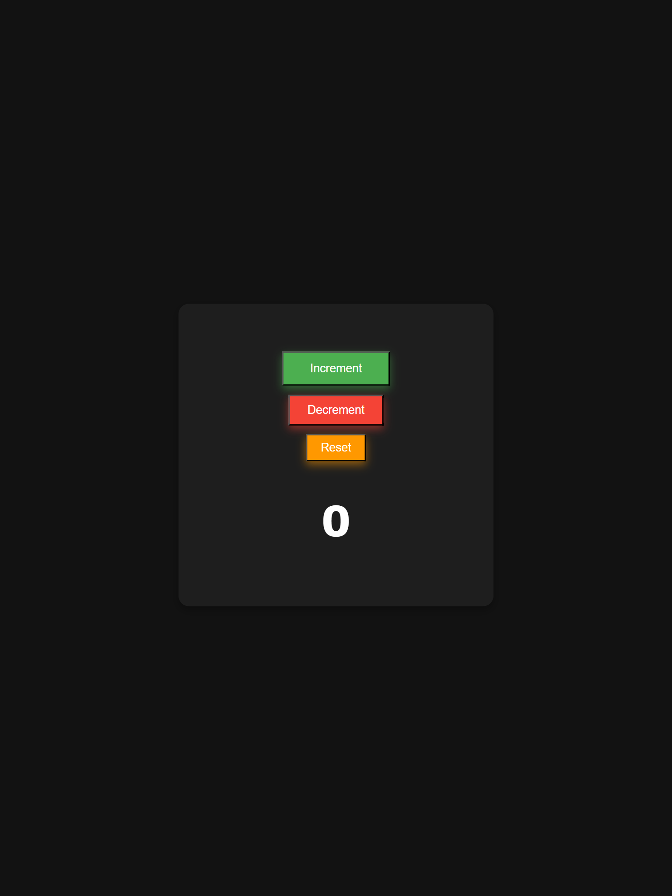

# Counter App

A simple counter app built using **React** and styled with **CSS**.

## Features

- Increment, decrement, and reset functionality
- Responsive and modern UI
- Smooth button animations

## Project Structure

```
 counterapp-p01/
 ├── src/
 │   ├── components/
 │   │   ├── Counter.js
 │   ├── App.js
 │   ├── index.css
 │   ├── index.js
 │
 ├── public/
 ├── package.json
 ├── README.md
```

## Usage

- Click the **Increment** button to increment the counter.
- Click the **Decrement** button to decrement the counter.
- Click the **Reset** button to set the counter back to zero.

## Technologies Used

- React (CRA - Create React App)
- CSS for styling

## Screenshots

- 

## links

- [Live Demo](https://counterapp-p01.netlify.app/)
